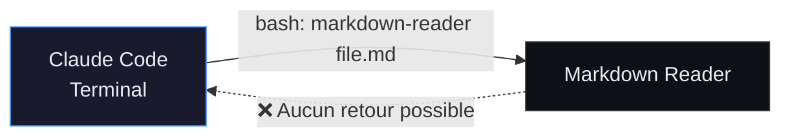
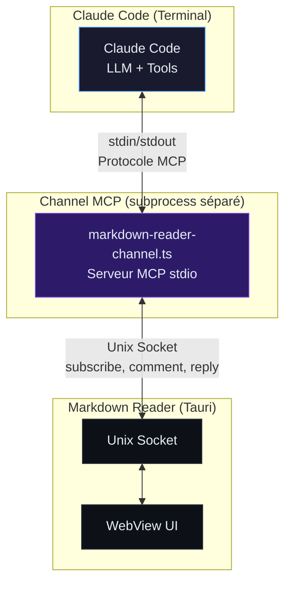
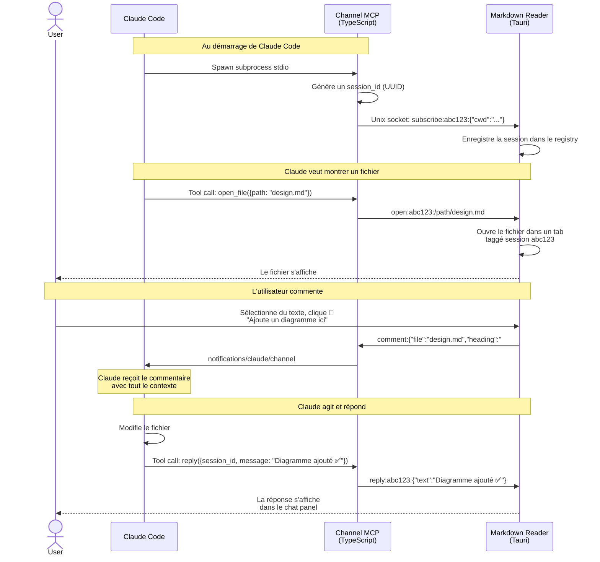
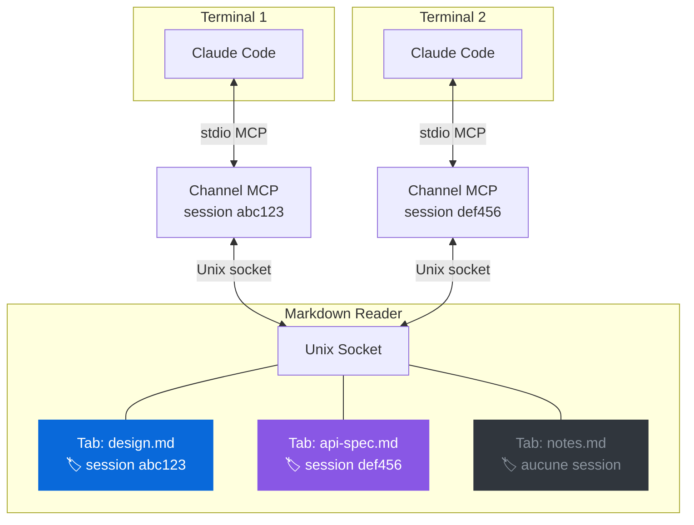
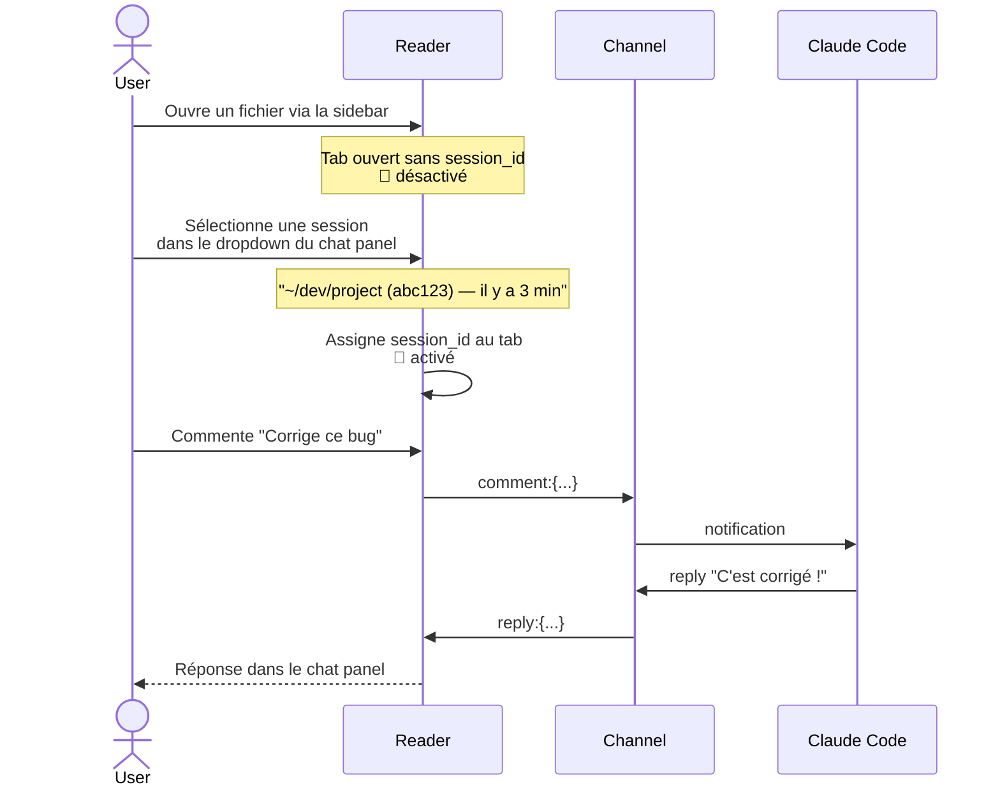

# Claude Code Channels — Comment ça marche ?

## Le problème



Claude ouvre un fichier dans le Reader via une commande bash. **Sens unique** : pas de moyen de renvoyer du feedback sans retourner au terminal.

---

## La solution : les Channels

Un **Channel** est un serveur MCP stdio que Claude Code lance comme subprocess. Il permet une **communication bidirectionnelle** entre une app externe et Claude.



Le channel est un **process TypeScript indépendant** que Claude Code spawne au démarrage. Il fait le pont entre le protocole MCP (stdio) et le Reader (Unix socket). Claude Code ne communique jamais directement avec le Reader.

---

## Le flux complet



---

## Multi-session : le routage

Chaque session Claude Code a **son propre channel** avec un session_id unique. Le Reader route les commentaires vers la bonne session.



- **Tab bleu** → commentaires vont au Terminal 1
- **Tab violet** → commentaires vont au Terminal 2
- **Tab gris** → ouvert manuellement, pas commentable (sauf si l'utilisateur choisit une session dans le sélecteur)

---

## Connexion initiée depuis le Reader

L'utilisateur peut aussi **connecter un tab manuellement** à une session Claude active, sans que Claude ait ouvert le fichier.



---

## Bonus : session ID dans la status line

Le channel écrit son session ID dans un fichier au démarrage (`$XDG_RUNTIME_DIR/md-reader-channel-{pid}.session`). Le script statusline de Claude Code le lit et l'affiche :

```
[21:35] [Opus 4.6] 📁 markdown-reader | 🌿 main | 🧠 45.2K (~23%) | 📎 a73140b6
```

Le `📎 a73140b6` c'est les 8 premiers caractères du session UUID — le même qu'on voit dans le sélecteur du Reader. Ça permet de faire le lien visuel entre le terminal et le Reader.

```bash
# Extrait du statusline.sh
CHANNEL_ID=$(
  for f in "$RUNTIME_DIR"/md-reader-channel-*.session; do
    [ -f "$f" ] || continue
    PID=$(echo "$f" | grep -oP '\d+(?=\.session)') || continue
    kill -0 "$PID" 2>/dev/null || continue   # process vivant ?
    head -1 "$f" | cut -c1-8                  # 8 premiers chars
    break
  done
) 2>/dev/null
```

---

## Stack technique

| Composant | Techno | Rôle |
|---|---|---|
| **Claude Code** | CLI Anthropic | LLM + orchestration |
| **Channel** | TypeScript + MCP SDK | Bridge stdio ↔ Unix socket |
| **Reader** | Tauri v2 (Rust + JS) | GUI + IPC server |
| **Socket** | Unix socket | Communication Reader ↔ Channel |
| **Protocole** | Ligne de texte préfixée | `subscribe:`, `open:`, `comment:`, `reply:` |

---

## Config

```json
// ~/.claude.json (global)
{
  "mcpServers": {
    "markdown-reader": {
      "type": "stdio",
      "command": "bun",
      "args": ["/path/to/channel/markdown-reader-channel.ts"]
    }
  }
}
```

```bash
# Lancer Claude avec le channel activé (research preview)
claude --dangerously-load-development-channels server:markdown-reader
```
