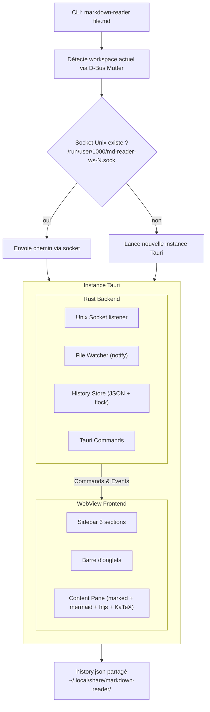
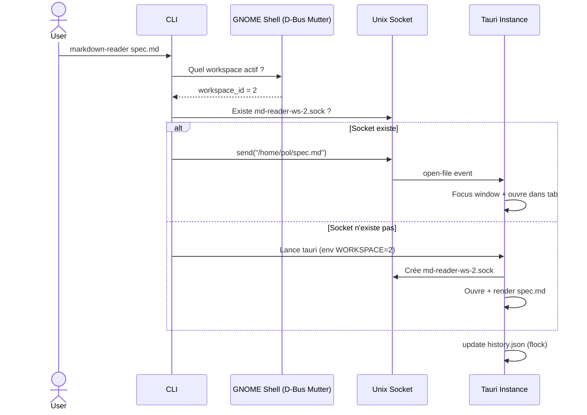
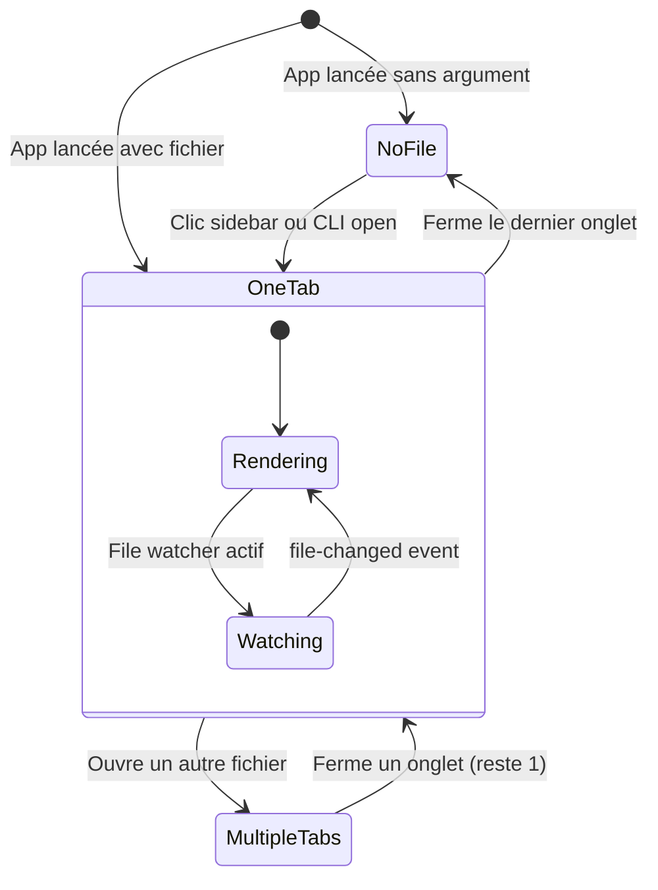
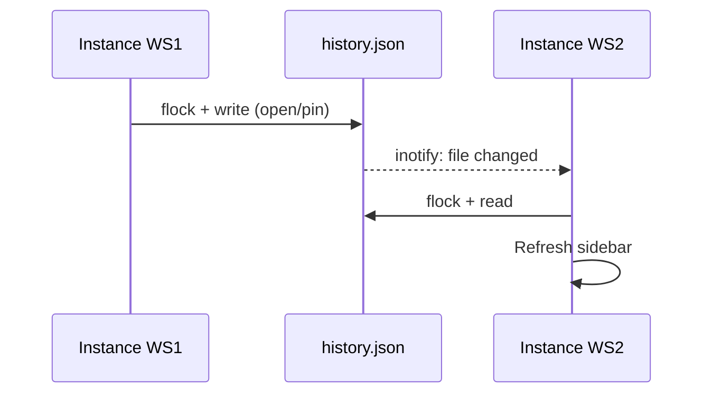

# Markdown Reader — Design Specification

## Résumé

Lecteur Markdown léger pour Linux (GNOME/Wayland), construit avec **Tauri v2** (Rust + WebKitGTK). Ouverture par CLI, multi-instance par workspace GNOME, rendu complet (GFM + Mermaid + syntax highlighting + LaTeX + TOC), live reload, et historique persistant des fichiers ouverts.

## Architecture



### Composants Rust Backend

| Composant | Responsabilité | Détail technique |
|---|---|---|
| **Unix Socket listener** | IPC entre CLI et instance | Socket par workspace dans `$XDG_RUNTIME_DIR/md-reader-ws-{N}.sock`. Nettoyé à la fermeture. |
| **File Watcher** | Live reload | Crate `notify`, émet event `file-changed` au frontend quand le fichier sur disque change. |
| **History Store** | Persistance historique + pins | Fichier JSON dans `~/.local/share/markdown-reader/history.json`. Accès concurrent via `flock`. |
| **Tauri Commands** | API frontend → backend | `read_file`, `get_history`, `update_history`, `pin_file`, `unpin_file`, `get_workspace_id` |

### Composants Frontend WebView

| Composant | Responsabilité |
|---|---|
| **Sidebar** | 3 sections : Épinglés, Récents, Par dossier |
| **Barre d'onglets** | Tabs des fichiers ouverts dans cette instance |
| **Content Pane** | Rendu Markdown complet |

## Multi-instance par workspace

### Principe

Chaque workspace GNOME peut avoir sa propre instance du reader. L'historique est partagé entre toutes les instances.

### Flow d'ouverture CLI



### Détection du workspace

Via D-Bus : `org.gnome.Mutter.IdleMonitor` ou `org.gnome.Shell` pour obtenir l'index du workspace actif. Pas besoin d'extension GNOME.

## Sidebar

### 3 sections

1. **📌 Épinglés** — fichiers pinnés manuellement, liste plate, format `nom — contexte`
2. **🕐 Récents** — tous les fichiers triés par `last_opened` desc, liste plate, format `nom — contexte`
3. **📂 Par dossier** — même fichiers que Récents mais organisés en arbre de dossiers récursif multi-niveaux, chaque niveau collapsible indépendamment. Les dossiers racines de l'arbre sont les ancêtres communs les plus hauts (git root ou 2 niveaux parents). La hiérarchie complète des sous-dossiers est préservée.

### Affichage des chemins

Deux formats selon la section :

#### Épinglés & Récents — format `nom — contexte`

Affichage en deux parties : **nom du fichier** en premier, puis **tiret** suivi d'un **contexte dossier** (tronqué si nécessaire).

**Algorithme du contexte :**
1. Chercher le git root du fichier (ou remonter de 2 niveaux parents si pas de repo git)
2. Afficher le chemin relatif du dossier parent depuis le git root
3. Si le contexte ne rentre pas → tronquer par le début avec `…`
4. Tooltip au hover : chemin complet

**Exemples pour `/home/pol/dev/perso/markdown-reader/docs/design-spec.md` :**

| Largeur | Affichage |
|---|---|
| Large | `design-spec.md — perso/markdown-reader/docs` |
| Moyenne | `design-spec.md — …markdown-reader/docs` |
| Étroite | `design-spec.md — …docs` |

Le nom du fichier n'est jamais tronqué. Seul le contexte s'adapte à la largeur.

#### Par dossier — chemin tronqué classique

Les dossiers parents dans l'arbre utilisent la troncature par le début avec `…`.

**Exemples :**

| Largeur | Affichage du dossier |
|---|---|
| Large | `perso/markdown-reader/docs/` |
| Moyenne | `…markdown-reader/docs/` |
| Étroite | `…docs/` |

Les fichiers à l'intérieur affichent seulement leur nom (le contexte est donné par le dossier parent).

### Pin / Unpin

- **Pin** : clic droit sur un fichier → "📌 Épingler"
- **Unpin** : clic sur ✕ dans la section Épinglés, ou clic droit → "Désépingler"
- Un fichier pinné reste aussi visible dans Récents et Par dossier

## Onglets

Chaque instance gère ses propres onglets (non persistés entre sessions).

- Clic sidebar → ouvre dans nouvel onglet (ou focus si déjà ouvert)
- Bouton ✕ pour fermer un onglet
- Middle-click pour fermer
- Onglet actif : bordure accent en haut
- Chaque onglet a son propre file watcher pour le live reload

### State machine



## Rendu Markdown

### Bibliothèques frontend

| Lib | Rôle |
|---|---|
| **marked.js** | Parser Markdown → HTML (GFM : tables, strikethrough, task lists, autolinks) |
| **mermaid.js** | Rendu diagrammes Mermaid dans les blocs ` ```mermaid ` |
| **highlight.js** | Syntax highlighting des blocs de code |
| **KaTeX** | Rendu LaTeX math (inline `$...$` et block `$$...$$`) |

### Features de rendu

- GitHub Flavored Markdown (GFM) complet
- Diagrammes Mermaid
- Syntax highlighting (tous les langages highlight.js)
- Formules LaTeX (KaTeX)
- Front matter YAML (masqué par défaut, pas interprété)
- Table of contents générée automatiquement depuis les headings

## Live Reload

- Crate `notify` côté Rust, surveille le fichier de l'onglet actif (et les autres onglets ouverts)
- Quand le fichier change → event `file-changed` émis au frontend
- Le frontend re-lit le contenu et re-rend le Markdown
- Debounce de ~200ms pour éviter les re-renders multiples lors d'écritures successives

## Thème

- Suit le thème système via `prefers-color-scheme` (WebKitGTK respecte le thème GTK)
- Mode clair et mode sombre
- Pas de toggle manuel pour l'instant — suit le système

## Data Model

### history.json

```json
{
  "version": 1,
  "pinned": [
    "/home/pol/dev/odys/saas/README.md",
    "/home/pol/notes/todo.md"
  ],
  "entries": [
    {
      "path": "/home/pol/dev/perso/markdown-reader/docs/design-spec.md",
      "last_opened": "2026-03-25T22:30:00Z",
      "open_count": 12
    }
  ]
}
```

| Champ | Type | Description |
|---|---|---|
| `version` | `u32` | Version du schéma pour migration future |
| `pinned` | `Vec<String>` | Chemins absolus des fichiers épinglés, ordre = ordre d'affichage |
| `entries[].path` | `String` | Chemin absolu du fichier |
| `entries[].last_opened` | `String` (ISO 8601) | Dernière ouverture |
| `entries[].open_count` | `u32` | Nombre d'ouvertures |

### Sync entre instances



### Fichiers sur disque

| Chemin | Contenu |
|---|---|
| `~/.local/share/markdown-reader/history.json` | Historique + pins |
| `$XDG_RUNTIME_DIR/md-reader-ws-{N}.sock` | Socket IPC par workspace |

## Stack technique

| Couche | Technologie |
|---|---|
| Framework | Tauri v2 |
| Backend | Rust |
| Frontend | HTML / CSS / JavaScript (vanilla, pas de framework) |
| Rendu MD | marked.js |
| Diagrammes | mermaid.js |
| Code highlighting | highlight.js |
| Math | KaTeX |
| File watching | `notify` (crate Rust) |
| IPC | Unix sockets |
| Workspace detection | D-Bus (GNOME Mutter) |
| Persistance | JSON + flock |

## Hors scope (v1)

- Édition de Markdown (lecture seule)
- Cross-platform (Linux GNOME/Wayland uniquement)
- Toggle thème manuel
- Recherche dans les fichiers
- Export PDF
- Persistance des onglets entre sessions
