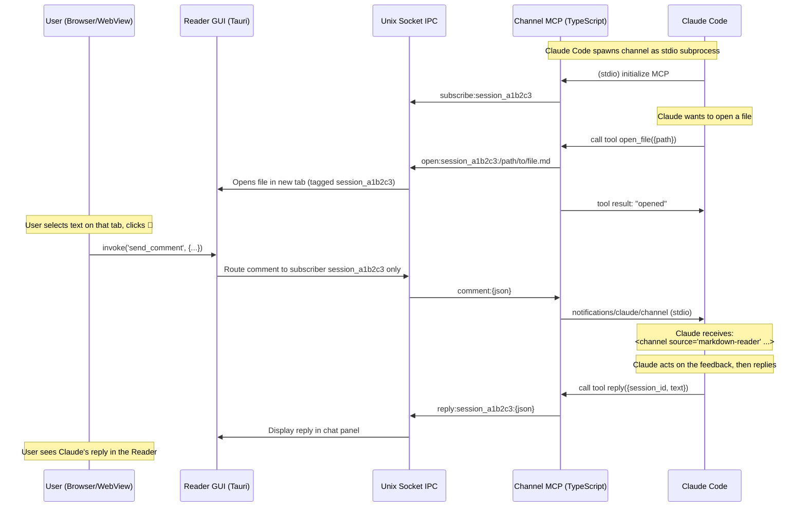
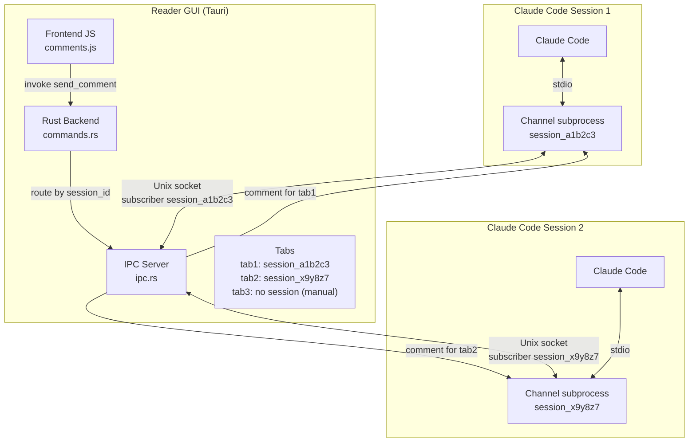

# MCP Inline Comments — Design Spec

## Summary

Add inline commenting to the Markdown Reader so users can select text (or click Mermaid/code blocks) and send feedback directly into their active Claude Code session. Claude can reply back, creating a two-way conversation visible in a chat panel at the bottom of the Reader. The Reader acts as a Claude Code Channel via a lightweight TypeScript bridge that communicates with the Tauri GUI over the existing Unix socket IPC.

## Motivation

When Claude Code generates plans, designs, or specs and opens them in the Markdown Reader, the user currently has to switch back to the terminal to give feedback. Inline comments let the user annotate the rendered document in-place, with positional context (file, heading, selected text) sent directly to Claude.

## Architecture

### Multi-session routing

Each Claude Code session spawns its own channel subprocess. Multiple sessions can be active simultaneously. Comments must be routed back to the correct session — the one that opened the file.

**Session ID:** Each channel process generates a unique session ID (UUID) at startup. This ID is passed along with every `open_file` request. The Reader tags each tab with the session ID of the channel that opened it. When the user comments, the comment is sent **only** to the subscriber matching that tab's session ID.

Files opened manually (sidebar, CLI) have no session ID and are not commentable.





## Components

### 1. Channel MCP — `channel/markdown-reader-channel.ts`

A TypeScript script using `@modelcontextprotocol/sdk` that acts as a Claude Code Channel.

**Responsibilities:**
- Connects to Claude Code via stdio (MCP standard)
- Declares `claude/channel` capability
- Connects to the Reader GUI via Unix socket (`$XDG_RUNTIME_DIR/md-reader-ws-{N}.sock`)
- Generates a unique session ID (UUID) at startup
- Subscribes to the Reader with its session ID (`subscribe:{session_id}`)
- Receives only comments from tabs tagged with its session ID
- Converts incoming comments to `notifications/claude/channel` events
- Exposes an `open_file` tool that passes the session ID so the Reader tags the tab
- Exposes a `reply` tool so Claude can send messages back to the Reader

**Channel declaration:**
```typescript
const mcp = new Server(
  { name: 'markdown-reader', version: '1.0.0' },
  {
    capabilities: {
      experimental: { 'claude/channel': {} },
      tools: {},
    },
    instructions:
      'Comments from the Markdown Reader arrive as <channel source="markdown-reader" file="..." heading="..." content_type="..." session_id="...">. ' +
      'They are user feedback on a document you generated or opened. Read them, act on the feedback, then reply using the reply tool with the session_id from the tag so the user sees your response in the Reader.',
  },
)
```

**Notification format:**
```typescript
await mcp.notification({
  method: 'notifications/claude/channel',
  params: {
    content: comment.comment,  // the user's feedback text
    meta: {
      file: comment.file,
      heading: comment.heading,
      selected_text: comment.selected_text,
      content_type: comment.content_type,  // "text", "mermaid", or "code"
    },
  },
})
```

**What Claude sees:**
```xml
<channel source="markdown-reader" file="/home/user/docs/design.md" heading="## Architecture" content_type="text" selected_text="the selected passage">
Add a sequence diagram here please
</channel>
```

**Tool `open_file`:**
```typescript
tools: [{
  name: 'open_file',
  description: 'Open a Markdown file in the Markdown Reader',
  inputSchema: {
    type: 'object',
    properties: {
      path: { type: 'string', description: 'Absolute path to the .md file' },
    },
    required: ['path'],
  },
}]
```

The tool handler sends `open:{session_id}:{path}` over the Unix socket. The Reader opens the file in a new tab tagged with the session ID. This tag is what routes comments back to the correct Claude Code session.

**Tool `reply`:**
```typescript
tools: [{
  name: 'reply',
  description: 'Send a reply to the user in the Markdown Reader chat panel',
  inputSchema: {
    type: 'object',
    properties: {
      session_id: { type: 'string', description: 'The session_id from the channel tag' },
      text: { type: 'string', description: 'The reply message (supports markdown)' },
    },
    required: ['session_id', 'text'],
  },
}]
```

The tool handler sends `reply:{session_id}:{json}\n` over the Unix socket. The Reader displays the reply in the chat panel of the tab associated with that session.

**Workspace detection:**
The channel needs to find the right socket. It reuses the same D-Bus call as the Rust code (`org.gnome.Shell.Eval` → `global.workspace_manager.get_active_workspace_index()`), falling back to workspace 0. Alternatively, the workspace number could be passed as an arg: `markdown-reader --mcp --workspace 0`.

### 2. IPC Extension — `src-tauri/src/ipc.rs`

**Current protocol (unchanged):**
- Client sends `ping` → server replies `pong`
- Client sends a file path → server opens it in a new tab

**New additions:**
- **Persistent connections with session ID:** A new message `subscribe:{session_id}\n` from a client tells the server to keep the connection open and register it as a subscriber with that session ID. The server maintains a map of `session_id → stream`.
- **Session-tagged file opening:** A new message `open:{session_id}:{path}\n` opens the file and tags the tab with the session ID.
- **Targeted comment routing:** When the GUI receives a comment via `send_comment`, it looks up the tab's session ID and writes `comment:{json}\n` **only** to the matching subscriber stream.
- **Subscriber cleanup:** When a subscriber disconnects (broken pipe), it is removed from the map. Tabs tagged with that session ID lose their "commentable" status.
- **Protocol summary:**

| Direction | Message | Response |
|---|---|---|
| Client → Server | `ping` | `pong` |
| Client → Server | `/path/to/file.md` | (opens file, no session) |
| Client → Server | `open:{session_id}:{path}` | (opens file, tagged) |
| Client → Server | `subscribe:{session_id}` | (keeps connection open) |
| Client → Server | `reply:{session_id}:{json}` | (Claude's reply, routed to GUI) |
| Server → Subscriber | `comment:{json}` | (push, targeted by session) |

### 3. Frontend — Chat Panel & Comments UI — `frontend/comments.js`

**Chat panel (bottom of document):**
- A collapsible panel anchored at the bottom of `#content-scroll`, visible only on commentable tabs
- Displays the conversation thread: user comments (aligned right) and Claude replies (aligned left)
- Each message shows a timestamp and the context (heading/selection) for user comments
- Claude replies support markdown rendering (inline, simple — bold, code, links)
- Panel auto-scrolls to the latest message
- A small badge/indicator shows unread replies if the panel is collapsed
- Panel state (open/collapsed) persisted in localStorage per tab

**Text selection commenting:**
- Listen to `mouseup` on `#content`
- If `window.getSelection()` is non-empty and the active tab is "commentable" (opened via MCP tool):
  - Show a small floating 💬 button near the selection
  - On click: expand into a textarea + "Envoyer" button
  - On submit: `invoke('send_comment', payload)` → message added to chat panel, form dismissed
  - On click outside or Escape: dismiss

**Block commenting (Mermaid/code):**
- Add `click` handlers on `.mermaid-container` and `pre > code` elements
- On click: add a highlight border class + show 💬 button
- The comment payload includes the source code (from a `data-source` attribute set during rendering)
- On click outside: remove highlight

**Comment payload:**
```typescript
{
  file: string,          // active tab path
  session_id: string,    // session that opened this tab (for routing)
  heading: string,       // nearest preceding h1-h6 text
  selected_text: string, // window.getSelection().toString() or block source
  content_type: "text" | "mermaid" | "code",
  comment: string        // user's typed feedback
}
```

**Finding the nearest heading:**
Walk backwards from the selection anchor node through previous siblings and parent elements until finding an `h1`–`h6`. Use its `textContent`.

**"Commentable" flag:**
Tabs opened via the MCP `open_file` tool get a `commentable: true` property. The comment UI only appears on these tabs. Files opened manually or from the sidebar are not commentable.

### 4. Tauri Command — `src-tauri/src/commands.rs`

**New command `send_comment`:**
```rust
#[derive(Deserialize, Serialize)]
struct Comment {
    file: String,
    session_id: String,
    heading: String,
    selected_text: String,
    content_type: String,  // "text", "mermaid", "code"
    comment: String,
}

#[tauri::command]
fn send_comment(state: State<IpcState>, comment: Comment) -> Result<(), String> {
    let session_id = comment.session_id.clone();
    let json = serde_json::to_string(&comment).map_err(|e| e.to_string())?;
    state.send_to_subscriber(&session_id, &format!("comment:{json}\n"));
    Ok(())
}
```

**Receiving replies from Claude:**

The IPC server receives `reply:{session_id}:{json}` from the channel. It emits a Tauri event `claude-reply` with the payload. The frontend listens for this event and appends the reply to the chat panel of the matching tab.

```rust
// In lib.rs, when IPC receives a reply message:
window.emit("claude-reply", reply_payload).unwrap();
```

```typescript
// In frontend/main.js:
listen('claude-reply', (event) => {
  // event.payload = { session_id, text }
  appendReplyToChat(event.payload);
});
```

### 5. Renderer Update — `frontend/renderer.js`

**Mermaid blocks:** During rendering, store the Mermaid source in a `data-source` attribute on the container element so `comments.js` can include it in the payload.

**Code blocks:** Similarly, store the raw code in `data-source` on the `pre` element.

### 6. Configuration

**`.mcp.json` (project-level):**
```json
{
  "mcpServers": {
    "markdown-reader": {
      "command": "markdown-reader-channel",
      "args": []
    }
  }
}
```

Or in the user's global Claude Code settings:
```json
{
  "mcpServers": {
    "markdown-reader": {
      "command": "node",
      "args": ["/path/to/markdown-reader/channel/markdown-reader-channel.js"]
    }
  }
}
```

**Claude Code launch:**
```bash
claude --channels server:markdown-reader
```

During research preview, custom channels need:
```bash
claude --dangerously-load-development-channels server:markdown-reader
```

## File Impact Summary

| File | Change |
|---|---|
| `channel/markdown-reader-channel.ts` | **New** — Two-way Channel MCP bridge (~120 lines) |
| `channel/package.json` | **New** — Dependencies (MCP SDK) |
| `src-tauri/src/ipc.rs` | **Modified** — Add persistent subscriptions + comment broadcast |
| `src-tauri/src/commands.rs` | **Modified** — Add `send_comment` command |
| `src-tauri/src/lib.rs` | **Modified** — Register `send_comment`, pass IPC state |
| `frontend/comments.js` | **New** — Comment UI + chat panel module (~200 lines) |
| `frontend/renderer.js` | **Modified** — Add `data-source` on Mermaid/code blocks |
| `frontend/main.js` | **Modified** — Import and wire comments module |
| `frontend/styles.css` | **Modified** — Comment button, form, highlight, toast styles |
| `src-tauri/src/main.rs` | **Modified** — Handle `--mcp` flag (launch channel mode or GUI) |

## Scope Boundaries

**In scope:**
- Single comment at a time, sent immediately
- Text selection + Mermaid/code block commenting
- Context: file path, nearest heading, selected text, content type
- Two-way channel: comments to Claude, replies back in the Reader
- Chat panel at the bottom of the document for the conversation thread
- `open_file` tool for Claude to open files
- `reply` tool for Claude to respond in the Reader
- Multi-session routing via session IDs

**Out of scope (future):**
- Batch comments (accumulate and send)
- Comment markers/annotations persisted in the document
- Permission relay
- Conversation persistence across Reader restarts
- Commenting on non-Markdown content
